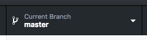
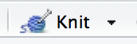
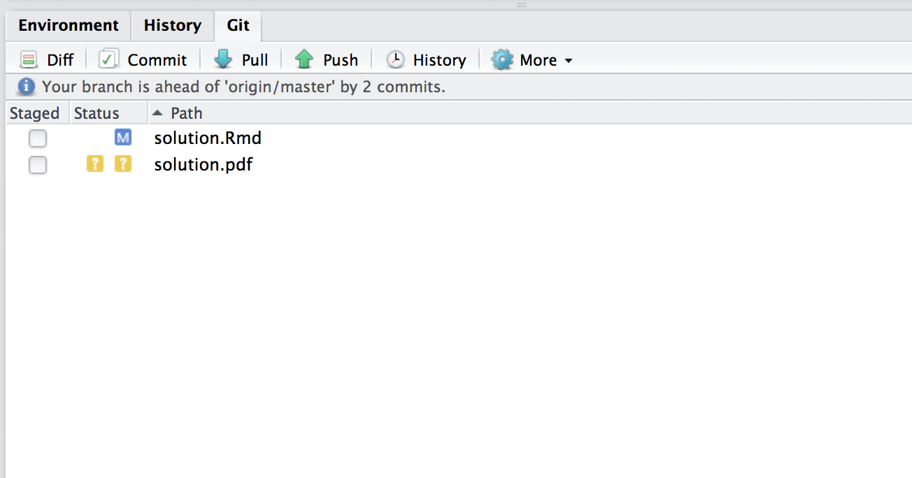
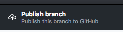
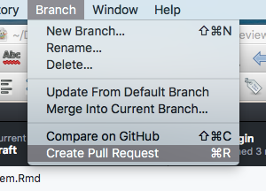

# Overview

## Purpose {-}

In this course, you will perform data analysis and simulation in 
the R programming language [@R-base], write your solution to 
homework assignments in R Markdown, and submit them through GitHub. 

Sounds unfamiliar? That's why I designed this homework. The purpose of this assignment is twofold.

1. To check if your environment for computation and writing is 
   up and running; and
2. To become familiar with GitHub workflow.

In this document, I will use a lot of functionalities of **rmarkdown** [@R-rmarkdown], **knitr** [@R-knitr] and **bookdown** [@R-bookdown] packages to demonstrate that you can write full academic papers with R Markdown. You don't need to understand all the details behind the scene now. After a bit of struggle with R, R Markdown and LaTeX, you will be able to tweak this source file to write your own paper. 

## In a nutshell {-}

In this assignment, you will

- clone the assignment repository;
- make a working branch;
- replicate the present PDF file with your name on the author line; and
- commit the change and open a Pull Request.
 
# System Requirements

## GitHub Account {-}

Make a github account if you don't have one.

- [GitHub](https://github.com/)

## Software {-}

Please install the following applications (they are free)

- R 
- RStudio
- LaTeX system ([texlive for Windows/Linux](https://www.tug.org/texlive/), 
  [MacTeX for macOS](https://tug.org/mactex/))
- [GitHub Desktop](https://desktop.github.com/)
- [Git for Windows](https://git-for-windows.github.io/) for Windows

If you plan to use a computer at the computer lab, follow the instructions in the Course Wiki https://github.com/rokko-ma17q4/hw-portal/wiki#computer-lab.

If you are not planning to use a university computer, and would rather use your own computer, please follow the instructions provided by the software developers/distributors. 

When you finish installation, follow the instructions below.


# Instructions

Here is the workflow for our assignments. 
Steps 1-3 and 7-11 are common to all the assignments and optional exercises.

## Step 1. Clone the assignment repository {-}

1. Click on "Get Invitation" located in the "Invitation Link" table you can find on https://github.com/rokko-ma17q4/hw-portal 
1. Accept the invitation and then your assignment repository is automatically created. 
1. Do you see "You ae now ready to go" message? Click on the link on the 
   line saying "Your assignment has been created here: ...."
1. Now you are at the GitHub repository page. This is where you get, put and submit the assignment files. To begin with, click the green button saying "Clone or download" and then click "Open in Desktop". 

Then GitHub Desktop will open.

## Step 2. Make a new branch with a descriptive name {-}

DO NOT start working on the problem yet! In GitHub Desktop, you should see 
something like Figure \@ref(fig:master-branch). It says that you are on the 
`master` branch, which is the default branch.^[If you are using RStudio 1.1.383, or newer, you can make a new branch from
within RStudio. Double-click on "hw##-youraccount.Rproj", move to 
Git pane, and find the way.]

```{r, master-branch, fig.align='center', fig.cap='master branch', echo=FALSE}

```

Make a new branch with a descriptive name by clicking the "Current Branch" tab. You'll find "New" button; clicking it will cause "Create a Branch" dialog to pop up. Enter the name for the new branch, say "`solution`". 

Wait a minute. What is a branch? A branch corresponds to a "line of development." You may want to divert from the main line of development (`master` branch) to do some experiments. 
If the experiments turn out to be unsuccessful, you can discard the experimental branch
without affecting the `master` branch. If they are successful, on the other hand,
you might want the `master` branch import the updates made in the experimental branch. In Git terminology, this is called `merge`. 

Branches are particularly useful when you work on a team. 
You can share your experiments, without affecting other members' work. Other members can review what you have done in your branch by checking the difference between merging and merged branches. In this course, the lecturer use this **diff** feature to check if the solutions seem correct. 

When you are on a branch you create, you should see something like 
Figure \@ref(fig:solution-branch) on the GitHub Desktop application.

```{r, solution-branch, fig.align='center', fig.cap='solution branch', echo=FALSE}
knitr::include_graphics("asset/images/solution-branch.png")
```

## Step 3. Open the assignment directory with RStudio {-}

Then open the folder (`hw01`) in which the repository resides, by 

- [Windows] Clicking the gear button and then "Open in Explorer"
- [Mac] Right-Clicking (Two-finger click) on hw01-yourGitHubUserName in the left area of GitHub Desktop and then selecting "Show in Finder" from the pop-up menu.

Double click on the hw01.Rproj icon. RStudio will open. 

## Step 4. Open this assignment file {-}

Look at the "Files" pane on RStudio, where you can find "solution.Rmd". 
Click it and now you see the source file (basically that's a 
trimmed version of this document).


## Step 5. Knit (and become friends with errors) {-}

Click "knit" button above the editor pane (Figure \@ref(fig:knit-button)). 
If this is the first time you try to knit Rmd file, you are prompted to install and/or 
update dependencies. 

```{r, knit-button, fig.align='center', fig.cap='knit button', echo=FALSE}

```

Success? Now, do you see a PDF file named `solution.pdf`? Everything seems to be okay? 
Congratulations, you are good to go!

If you don't see the PDF, hang in there. Since this is a common case, don't be ashamed of having caused an error. As you learn how to code, you'll encounter even more error messages (not less!!).

What you need to do is read the error message carefully. Try to figure out what caused it. After a careful reading of error message, you sometimes can fix it by yourself. But not always. If you still don't know what to do, copy the error message and search for an answer on Google. If you still can't fix, ask the TA or lecturer on the slack team. https://rokkoecon-slack-invite.herokuapp.com/

**IMPORTANT!!!** Don't ask us an "I can't compile... something went wrong" kind of vague question. The instructors (or your friends) will need more information. Read the error message carefully (I say this repeatedly because this is crucial) and ask this way: "I did ... expecting to get ... but I got an error message instead saying (this and that)... I will send the whole error message and the result of `sessionInfo()` to you. Do you know how to get rid of it?"

Your problem was probably caused by missing packages? As a matter of fact, this Rmd depends on not-preinstalled packages called **tidyverse** [@R-tidyverse] and **bookdown** [@R-bookdown]. Please install them by running the following command in the console pane.

```{r, eval=FALSE}
install.packages("bookdown")
install.packages("tidyverse")
```

`install.packages("package_name")` is a typical way of installing packages on R. Please remember it. 

## Step 6. Make modifications {-}

You may want to modify the source because the output PDF file has a strange author 
name on it: "Your name". Find the way to change the author name. Put your name there.

Save the file and knit again.

Now you know how to create a professional-quality paper (in appearance) with  code, tables, graphs and mathematical expressions and references! (See the Example sections below.)


## Step 7. Commit {-}

Locate the "Git" pane within RStudio. After the modification and knitting, it should look like 
Figure \@ref(fig:git-pane).

```{r, git-pane, echo=FALSE, fig.align='center', fig.cap='Git pane', out.width="300px"}

```

Stage `solution.Rmd` and `solution.pdf` by checking the box on the left
of the file names. This corresponds to the git command `git-add`.^[See https://www.atlassian.com/git/tutorials/saving-changes]

Then click on the "Commit"" button. A new window will open and you will be requested to write a commit message. Write a short description of what you did and why. Click "Commit" button when finished.

Think of committing as journaling. When you've done something important, always make a commit to record the change. (Be generous when judging "importance.")

## Step 8. Publish/Push and Open a Pull Request {-}

Let's go back to GitHub Desktop application. Navigate to the homework repository; you should now be in the process of working on hw01. The "History" tab shows what changes you made. Check that every change you are supposed to make is highlighted by green (addition) and red (deletion). If you don't see anything important, check that you have indeed committed your changes.

```{r, publish, fig.align='center', fig.cap='Publish', echo=FALSE}

```

Now is the time to put them on the server. Click on the "Publish branch" button (Figure \@ref(fig:publish)), the files are sent to the server.  

Wait! The submission's not done yet!

You need to make a "Pull Request" to notify the lecturer about your having uploading your homework assignment. Navigate through "Branch > Pull Request" (Figure \@ref(fig:pr)) or simply hit "Command+R". Then follow the instructions of GitHub web service.

```{r, pr, fig.align='center', fig.cap='Pull Request (PR)', echo=FALSE}

```

Congratulations, you are done!

## Step 9. Update the submission {-}

We make mistakes. Sometimes, we discover them after submitting the homework.
Although you cannot erase the history, you can update the submission. 

Open RStudio, make your modifications and knit again, and go to the Git pane. Check the modified files and make a commit. Then click **push**. 
N.B.: there is no need to create a new Pull Request for modifications. Clicking Push in the Git pane of RStudio is enough for modifications.

## Step 10. Receive comments, update, and merge {-}

Git is used for recording. GitHub is a communication platform based on Git.
The lecturer exploits this communication feature to make your solutions better. 

After you commit, the lecturer will 

* request modifications if the solutions contain major mistakes, 
* make comments and merge if there are small but important mistakes,
* merge without comments if there are no outstanding mistakes. 

Please do as requested. After modification on the same branch, you can 
simply commit and push on RStudio. The Pull Request will be updated
automatically.

## Step 11. Receive suggested solution {-}

Those who submit a homework assignment will be invited to a repository of mine or teaching assistant's. The repository will contain a suggested solution to the assignment. 

NB: If the submission shows no trace of effort, we won't share the suggested solution.


In the rest of the handout, I show you a small portion of what you can do with R and Rmarkdown.


# Example: R code and output in a document

As you can see by comparing the source code (`problem.Rmd` file) and the  rendered document (`problem.pdf` file), the lines between `` ```{r} `` and `` ``` `` (i.e., the lines embraced by a pair of triple backticks, with engine name "r") are executed by R and the PDF file contains both the code and its output. It is also possible to suppress code and/or ouput. With this  feature of R Markdown and Kintr, you can easily write a report, paper, or whatever, for your data analysis project. This is what you are to learn in this course.

Let's do a quick data visualization exercise. 

Load a library first. We will use many functions from **tidyverse** package. Loading **tidyverse** causes several messages because it overwrites some functions loaded by default. You can suppress the warning messages by setting `message=FALSE` option. **IMPORTANT: Do this only when you are certain that you can safely ignore the message.**

```{r, message=FALSE}
library(tidyverse)
```

Declare an object `iris_tbl` from a preloaded dataset.

```{r}
(iris_tbl <- as_data_frame(iris))
```

The raw output of R is not very beautiful for PDF. You probably want to use `knitr::kable()` function to print a table. Table \@ref(tab:iris-print) is produced by the following code.

```{r iris-print}
knitr::kable(head(iris_tbl, 10), caption = "Iris dataset")
```

The following code generates and print Figure \@ref(fig:iris).^[See http://stackoverflow.com/questions/38861041/knitr-rmarkdown-latex-how-to-cross-reference-figures-and-tables/38884378#38884378]

```{r iris, fig.cap="Iris Data", fig.align='center', fig.width=4, fig.height=3}
ggplot(iris_tbl) + 
  geom_point(aes(x = Sepal.Length, y = Petal.Length, color = Species)) 
```


# Example: Mathematical expressions using LaTeX

You can produce mathematical equations using LaTeX syntax: 

\begin{equation}
f(x) = f(0) + \int_0^x f'(y) dy.  (\#eq:ftc)
\end{equation}


Cross reference works like Equation \@ref(eq:ftc) but the syntactic rule is different from LaTeX. 
See [https://bookdown.org/yihui/bookdown/markdown-extensions-by-bookdown.html#equations](https://bookdown.org/yihui/bookdown/markdown-extensions-by-bookdown.html#equations) for more detail.


# References {-}


